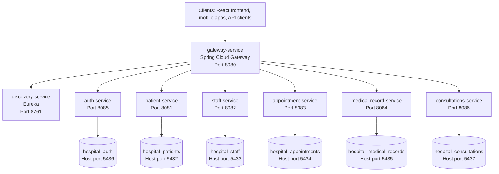

# Hospital Patient Microservices Platform


This repository contains a Spring Boot microservices platform for hospital patient-data management. It includes the common clinical services, authentication, service discovery, an API security gateway, PostgreSQL databases per service, and a React frontend.

The platform is designed around the "database per service" pattern and exposes all client API traffic through `gateway-service` on port `8080`.

## Contents

- [Architecture](#architecture)
- [Technology Stack](#technology-stack)
- [Service Catalog](#service-catalog)
- [Repository Layout](#repository-layout)
- [Quick Start](#quick-start)
- [Running Locally With Maven](#running-locally-with-maven)
- [Running With Docker Compose](#running-with-docker-compose)
- [Running With HTTPS](#running-with-https)
- [Frontend](#frontend)
- [Authentication And Authorization](#authentication-and-authorization)
- [API Reference](#api-reference)
- [Data Protection And Compliance](#data-protection-and-compliance)
- [Configuration](#configuration)
- [Testing](#testing)
- [Operational Checks](#operational-checks)
- [Troubleshooting](#troubleshooting)
- [Related Documentation](#related-documentation)

## Architecture



In the Docker stack, backend services are attached to the internal `hospital-network`. Only the gateway and Eureka dashboard are exposed to the host. This keeps the public API surface centralized and lets the gateway enforce authentication, RBAC, rate limiting, input validation, and security headers.

## Technology Stack

| Area | Technology |
|------|------------|
| Backend | Java 17, Spring Boot 3.2.0 |
| Microservices | Spring Cloud 2023.0.0, Spring Cloud Gateway, OpenFeign, Eureka |
| Persistence | PostgreSQL 15, Spring Data JPA, Hibernate |
| Security | JWT, HS256 fallback, RS256 support, gateway RBAC, rate limiting |
| API docs | SpringDoc/OpenAPI where configured in services |
| Mapping | MapStruct, Lombok |
| Frontend | React 18, TypeScript, Vite, Chakra UI |
| Build | Maven multi-module project, Docker, Docker Compose |

## Service Catalog

| Service | Port | Responsibility | Database |
|---------|------|----------------|----------|
| `gateway-service` | 8080 | Public API entry point, routing, JWT verification, RBAC, rate limiting, anti-bruteforce by IP, input validation, secure headers, audit/IDS event emission | None |
| `discovery-service` | 8761 | Eureka service registry and discovery dashboard | None |
| `auth-service` | 8085 | User registration, login, refresh tokens, JWT generation, account anonymization/deletion, account-level anti-bruteforce | `hospital_auth` |
| `patient-service` | 8081 | Patient CRUD, search, consent withdrawal, dossier aggregation/export, retention purge, cascade deletion orchestration | `hospital_patients` |
| `staff-service` | 8082 | Staff members, roles, specialties, doctor lookup | `hospital_staff` |
| `appointment-service` | 8083 | Appointment CRUD, doctor/patient schedules, status updates, patient appointment deletion | `hospital_appointments` |
| `medical-record-service` | 8084 | Medical record lifecycle, entries, patient medical-record deletion | `hospital_medical_records` |
| `consultations-service` | 8086 | Consultation lifecycle, patient history, doctor/date filtering, patient consultation deletion | `hospital_consultations` |
| `frontend` | 5173 | React web UI that calls the gateway | None |

## Repository Layout

```text
.
|-- auth-service/
|-- appointment-service/
|-- consultations-service/
|-- discovery-service/
|-- gateway-service/
|-- medical-record-service/
|-- patient-service/
|-- staff-service/
|-- frontend/
|-- docker/
|-- docker-compose.yml
|-- docker-compose.dev.yml
|-- docker-compose.tls.yml
|-- pom.xml
|-- README.md
|-- AUDIT-IDS-EVENTS.md
|-- RGPD-COMPLIANCE.md
`-- SECURITY-ENCRYPTION.md
```

The root `pom.xml` is a Maven parent project. It centralizes Java, Spring Cloud, MapStruct, Lombok, and shared test dependencies for all backend services.

## Quick Start

### Prerequisites

- Java 17 or newer
- Maven 3.8 or newer
- Docker and Docker Compose
- Node.js 18 or newer for the frontend

### Start everything with Docker

```bash
docker-compose up -d --build
```

Useful URLs after startup:

| URL | Purpose |
|-----|---------|
| `http://localhost:8080/actuator/health` | Gateway health |
| `http://localhost:8761` | Eureka dashboard |
| `http://localhost:8080/api/auth/login` | Authentication entry point |

Stop the stack:

```bash
docker-compose down
```

Stop the stack and remove database volumes:

```bash
docker-compose down -v
```

## Running Locally With Maven

Use this mode when you want fast backend development with local Java processes and Dockerized databases.

1. Start PostgreSQL databases only:

   ```bash
   docker-compose -f docker-compose.dev.yml up -d
   ```

2. Start the discovery service first:

   ```bash
   cd discovery-service
   mvn spring-boot:run
   ```

3. Start the gateway:

   ```bash
   cd gateway-service
   mvn spring-boot:run
   ```

4. Start the auth service:

   ```bash
   cd auth-service
   mvn spring-boot:run
   ```

5. Start the remaining services in separate terminals:

   ```bash
   cd patient-service && mvn spring-boot:run
   cd staff-service && mvn spring-boot:run
   cd appointment-service && mvn spring-boot:run
   cd medical-record-service && mvn spring-boot:run
   cd consultations-service && mvn spring-boot:run
   ```

Local database ports:

| Service | Database | Host Port |
|---------|----------|-----------|
| patient-service | `hospital_patients` | 5432 |
| staff-service | `hospital_staff` | 5433 |
| appointment-service | `hospital_appointments` | 5434 |
| medical-record-service | `hospital_medical_records` | 5435 |
| auth-service | `hospital_auth` | 5436 |
| consultations-service | `hospital_consultations` | 5437 |

## Running With Docker Compose

The main Compose file builds and starts all backend services and all databases:

```bash
docker-compose up -d --build
docker-compose logs -f gateway-service
```

In this mode:

- `gateway-service` is exposed on host port `8080`.
- `discovery-service` is exposed on host port `8761`.
- Backend microservice ports are not exposed to the host.
- Each service uses its own PostgreSQL container.
- Service discovery uses Eureka through `http://discovery-service:8761/eureka/`.

## Running With HTTPS

The gateway can run with TLS on port `8080`.

If `gateway-dev.p12` already exists in the repository root, the TLS override can use it directly. Otherwise generate a development keystore:

Windows:

```powershell
cd gateway-service
.\scripts\generate-dev-keystore.bat
cd ..
```

Linux or macOS:

```bash
cd gateway-service
./scripts/generate-dev-keystore.sh
cd ..
```

Start the TLS stack:

```bash
docker-compose -f docker-compose.yml -f docker-compose.tls.yml up -d --build
```

Verify:

```bash
curl -k https://localhost:8080/actuator/health
```

Use `https://localhost:8080` for API calls when TLS is enabled. The certificate generated by the development script is self-signed, so browsers and command-line clients may require explicit trust or an insecure/dev flag.

## Frontend

The frontend is in `frontend/`.

```bash
cd frontend
npm install
npm run dev
```

By default, the app expects the gateway at:

```text
VITE_API_URL=http://localhost:8080
```

Create `frontend/.env` from `frontend/.env.example` if you need to point the UI to a different gateway URL.

Production build:

```bash
npm run build
npm run preview
```

## Authentication And Authorization

### Login flow

1. A client sends credentials to `POST /api/auth/login`.
2. `auth-service` validates the user and returns an access token plus refresh token.
3. The client sends protected requests through the gateway with:

   ```http
   Authorization: Bearer <accessToken>
   ```

4. The gateway verifies the token and forwards technical identity headers to downstream services:

   ```http
   X-User-Id: <user id>
   X-Username: <username>
   X-User-Roles: ROLE_ADMIN,ROLE_DOCTOR
   ```

Public paths:

- `POST /api/auth/login`
- `POST /api/auth/register`
- `POST /api/auth/refresh`
- `/actuator/health`

All other API paths require a valid bearer token.

### JWT algorithms

- RS256 is recommended for production. Configure a private key in `auth-service` and the matching public key in `gateway-service`.
- HS256 is the development fallback. Both services must share the same Base64-encoded `JWT_SECRET`.

### RBAC summary

The gateway enforces role-based access for patient, medical-record, consultation, and appointment resources. Highlights:

- `ROLE_ADMIN` can delete protected health information.
- Clinical roles can read and create/update records according to the policy in `gateway-service/src/main/java/com/hospital/gateway/rbac/RbacPolicy.java`.
- `ROLE_PATIENT` can access its own dossier/export and can request deletion of its own patient record when the path ID matches `X-User-Id`.
- Denied requests return `403 Forbidden` and can emit `ACCESS_DENIED` audit events.

See [gateway-service/GATEWAY-HTTPS.md](gateway-service/GATEWAY-HTTPS.md) for the detailed gateway security runbook.

## API Reference

All endpoints below should be called through the gateway:

```text
http://localhost:8080
```

### Auth

| Method | Path | Description |
|--------|------|-------------|
| POST | `/api/auth/register` | Register a user and return tokens |
| POST | `/api/auth/login` | Authenticate and return tokens |
| POST | `/api/auth/refresh` | Refresh the access token using the `Refresh-Token` header |
| GET | `/api/auth/validate` | Validate a bearer token |
| PUT | `/api/auth/account/{userId}/anonymize` | Anonymize a user account |
| DELETE | `/api/auth/account/{userId}` | Delete a user account |

### Patients

| Method | Path | Description |
|--------|------|-------------|
| POST | `/api/patients` | Create a patient |
| GET | `/api/patients` | List all patients |
| GET | `/api/patients/{id}` | Get a patient by ID |
| GET | `/api/patients/national-id/{nationalId}` | Get a patient by national ID |
| GET | `/api/patients/search?query={term}` | Search patients by name |
| PUT | `/api/patients/{id}` | Update a patient |
| DELETE | `/api/patients/{id}` | Delete a patient and cascade PHI deletion |
| GET | `/api/patients/{id}/exists` | Check whether a patient exists |
| GET | `/api/patients/{id}/dossier` | Get the aggregated patient dossier |
| GET | `/api/patients/{id}/dossier/export` | Export the dossier as JSON |
| PUT | `/api/patients/{id}/consent/withdraw` | Withdraw data-processing consent |

### Staff

| Method | Path | Description |
|--------|------|-------------|
| POST | `/api/staff` | Create a staff member |
| GET | `/api/staff` | List staff members |
| GET | `/api/staff/{id}` | Get a staff member by ID |
| GET | `/api/staff/role/{role}` | Filter staff by role |
| GET | `/api/staff/doctors/specialty/{specialty}` | Find doctors by specialty |
| PUT | `/api/staff/{id}` | Update a staff member |
| DELETE | `/api/staff/{id}` | Deactivate a staff member |
| GET | `/api/staff/{id}/exists` | Check whether a staff member exists |

### Appointments

| Method | Path | Description |
|--------|------|-------------|
| POST | `/api/appointments` | Create an appointment |
| GET | `/api/appointments/{id}` | Get an appointment |
| GET | `/api/appointments/patient/{patientId}` | List appointments for a patient |
| GET | `/api/appointments/doctor/{doctorId}` | List appointments for a doctor |
| GET | `/api/appointments/doctor/{doctorId}/date/{date}` | List a doctor's appointments for a date |
| PUT | `/api/appointments/{id}` | Update an appointment |
| PATCH | `/api/appointments/{id}/status?status={status}` | Update appointment status |
| DELETE | `/api/appointments/{id}` | Cancel an appointment |
| DELETE | `/api/appointments/patient/{patientId}` | Delete all appointments for a patient |

### Medical Records

| Method | Path | Description |
|--------|------|-------------|
| POST | `/api/medical-records/patient/{patientId}` | Create a medical record for a patient |
| GET | `/api/medical-records/{id}` | Get a medical record by ID |
| GET | `/api/medical-records/patient/{patientId}` | Get a patient's medical record |
| GET | `/api/medical-records/patient/{patientId}/ensure` | Get or create a patient's medical record |
| PUT | `/api/medical-records/{id}` | Update a medical record |
| POST | `/api/medical-records/patient/{patientId}/entries` | Add a medical entry |
| DELETE | `/api/medical-records/patient/{patientId}` | Delete a patient's medical record and entries |

### Consultations

| Method | Path | Description |
|--------|------|-------------|
| POST | `/api/consultations` | Create a consultation |
| GET | `/api/consultations` | List consultations |
| GET | `/api/consultations/{id}` | Get a consultation by UUID |
| GET | `/api/consultations/patient/{patientId}` | Get a patient's consultation history |
| GET | `/api/consultations/doctor/{userId}` | Get consultations for a doctor |
| GET | `/api/consultations/date-range?start={dateTime}&end={dateTime}` | Get consultations in a date range |
| PUT | `/api/consultations/{id}` | Update a consultation |
| DELETE | `/api/consultations/{id}` | Delete a consultation |
| DELETE | `/api/consultations/patient/{patientId}` | Delete all consultations for a patient |

## Data Protection And Compliance

This project includes security and compliance features relevant to protected health information:

- JWT authentication at the gateway.
- Gateway RBAC for sensitive resources.
- Per-IP and per-user rate limiting.
- Per-IP login anti-bruteforce at the gateway.
- Per-account login anti-bruteforce in `auth-service`.
- Input validation against SQL injection and XSS-like query/header values.
- Secure response headers from Spring Cloud Gateway.
- Audit and IDS event payloads without raw PII/PHI.
- Consent fields and consent withdrawal in `patient-service`.
- Patient dossier aggregation and JSON export.
- Patient deletion cascade across medical records, consultations, and appointments.
- Retention purge job in `patient-service`.
- Account anonymization/deletion support in `auth-service`.

See:

- [RGPD-COMPLIANCE.md](RGPD-COMPLIANCE.md)
- [SECURITY-ENCRYPTION.md](SECURITY-ENCRYPTION.md)
- [AUDIT-IDS-EVENTS.md](AUDIT-IDS-EVENTS.md)

## Configuration

Most service settings live in each service's `src/main/resources/application.yml`.

Important environment variables:

| Variable | Used By | Purpose |
|----------|---------|---------|
| `SPRING_PROFILES_ACTIVE` | All services | Enables `docker`, `dev`, or `tls` profiles |
| `SPRING_DATASOURCE_URL` | Backend services | Overrides database URL |
| `EUREKA_CLIENT_SERVICE_URL_DEFAULTZONE` | Backend services | Overrides Eureka location |
| `JWT_SECRET` | `auth-service`, `gateway-service` | Shared HS256 secret |
| `JWT_PRIVATE_KEY`, `JWT_PRIVATE_KEY_LOCATION` | `auth-service` | RS256 signing key |
| `JWT_PUBLIC_KEY`, `JWT_PUBLIC_KEY_LOCATION` | `gateway-service` | RS256 verification key |
| `SERVER_SSL_ENABLED` | `gateway-service` | Enables HTTPS |
| `SERVER_SSL_KEY_STORE` | `gateway-service` | Keystore path |
| `SERVER_SSL_KEY_STORE_PASSWORD` | `gateway-service` | Keystore password |
| `RATE_LIMIT_REQUESTS_PER_MINUTE_PER_IP` | `gateway-service` | IP rate limit |
| `RATE_LIMIT_REQUESTS_PER_MINUTE_PER_USER` | `gateway-service` | User rate limit |
| `BRUTEFORCE_IP_MAX_FAILED_ATTEMPTS` | `gateway-service` | Login failures before IP block |
| `AUTH_BRUTEFORCE_MAX_FAILED_ATTEMPTS` | `auth-service` | Login failures before account lock |
| `INPUT_VALIDATION_ENABLED` | `gateway-service` | Enables/disables gateway input validation |
| `RETENTION_PURGE_ENABLED` | `patient-service` | Enables scheduled retention purge |
| `RETENTION_PURGE_CRON` | `patient-service` | Purge schedule |
| `security.audit.url` | Gateway and PHI services | Audit endpoint, configured as application property |
| `security.ids.url` | Gateway | Optional IDS endpoint, configured as application property |

## Testing

Run all backend tests from the repository root:

```bash
mvn test
```

Run a specific service:

```bash
cd gateway-service
mvn test
```

Run a specific test class:

```bash
mvn test -Dtest=AppointmentServiceImplTest
```

Builds inside Docker run Maven as part of each service image build. If tests fail during image creation, the Compose build fails.

Frontend build check:

```bash
cd frontend
npm run build
```

## Operational Checks

After `docker-compose up -d --build`:

```bash
curl -s -o /dev/null -w "%{http_code}" http://localhost:8080/actuator/health
# Expected: 200

curl -s -o /dev/null -w "%{http_code}" http://localhost:8080/api/patients/1
# Expected: 401 without a token
```

With a valid token:

```bash
curl -H "Authorization: Bearer <accessToken>" http://localhost:8080/api/patients/1
```

Depending on data and role, the response should be a backend response such as `200`, `404`, or a gateway authorization response such as `403`.

## Troubleshooting

| Symptom | Likely Cause | Fix |
|---------|--------------|-----|
| Gateway returns `503` | Service is not registered in Eureka or not healthy | Check `http://localhost:8761` and service logs |
| Protected endpoint returns `401` | Missing, expired, malformed, or invalid JWT | Login again and send `Authorization: Bearer <token>` |
| Protected endpoint returns `403` | Role is not allowed by gateway RBAC | Check token roles and `RbacPolicy` |
| Gateway returns `429` | IP or user exceeded rate limit | Wait for the window to reset or adjust rate-limit config |
| Login returns `423` | Account or IP is temporarily locked | Wait for lockout duration or adjust bruteforce config |
| SQL/XSS-like query returns `400` | Gateway input validation rejected the request | Remove suspicious query/header content |
| Service cannot connect to DB locally | Database container not running or wrong port | Start `docker-compose.dev.yml` and verify ports |
| HTTPS health check fails | Self-signed certificate or wrong keystore config | Use `curl -k`, verify TLS env vars and mounted keystore |

## Related Documentation

- [Root audit and IDS event reference](AUDIT-IDS-EVENTS.md)
- [GDPR/HIPAA compliance notes](RGPD-COMPLIANCE.md)
- [Encryption and secure disposal](SECURITY-ENCRYPTION.md)
- [Gateway HTTPS and security runbook](gateway-service/GATEWAY-HTTPS.md)
- [Gateway security overview](gateway-service/SECURITY-GATEWAY.md)
- [Gateway validation schemas](gateway-service/VALIDATION-SCHEMAS.md)
- [Auth security](auth-service/AUTH-SECURITY.md)
- [Frontend README](frontend/README.md)
